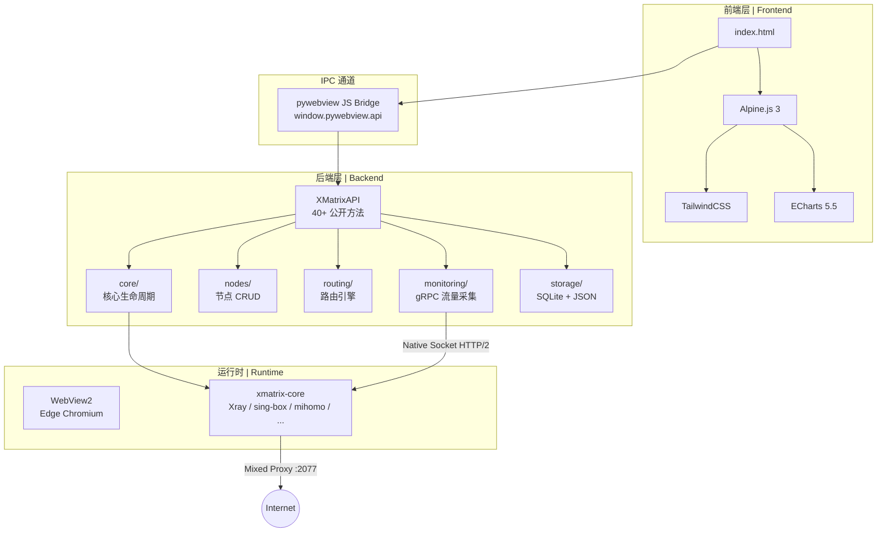
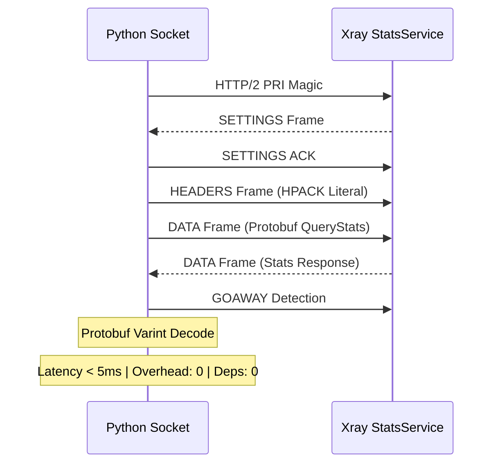
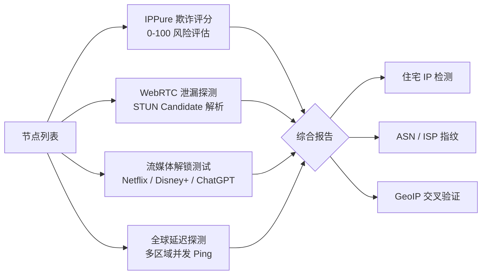
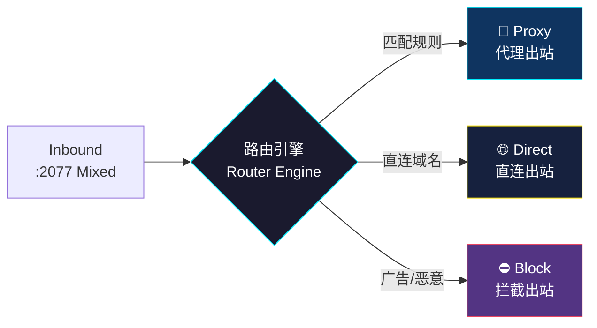

<div align="center">


<br/>


<br/>

> 🛠️ **工程定位 | Project Status**
>
> 本项目目前定位为【纯开发/实验性项目】。核心架构正处于快速迭代期，尚未经过大规模真实用户的使用体验与多场景生产环境的严苛验证。
>
> ⚠️ **体验说明 | Notice**
>
> 软件功能与 API 接口可能在任意版本之间发生 Breaking Change，不保证向后兼容。请勿将其用于关键生产环境。
>
> 🤝 **开源协作 | Open Source Collaboration**
>
> 深度践行开源极客精神，防线的完善离不开社区。热烈欢迎全球开发者前来 **Fork** 仓库、通过 **Issues** 提交 Bug 或改进建议，并积极提交 **Pull Requests** 参与联合协同开发！

</div>

---

## ⚡ 架构概览 | Architecture Overview



---

## ✨ 核心特性 | Core Features

### 🔐 协议全覆盖 | Full Protocol Coverage

支持 **VLESS**（REALITY / XTLS Vision）、**VMess**、**Trojan**、**Shadowsocks**、**SOCKS5**、**HTTP** 六大协议。传输层覆盖 TCP、WebSocket、gRPC、KCP（mKCP）。智能剪贴板 URI 捕获，`Ctrl+V` 秒级批量导入节点。

| 协议 Protocol | 传输层 Transport | 安全层 Security |
|:---:|:---:|:---:|
| VLESS | TCP / WS / gRPC / KCP | REALITY / TLS / None |
| VMess | TCP / WS / gRPC / KCP | TLS / None |
| Trojan | TCP / WS / gRPC | TLS / None |
| Shadowsocks | TCP / UDP | None |
| SOCKS5 | TCP / UDP | None |
| HTTP | TCP | None |

### 📊 零开销监控 | Zero-Overhead Monitor

后端手写原生 Socket 解析 HTTP/2 + gRPC 帧，直接与 Xray StatsService 通信。**零子进程、零第三方库、零序列化开销**。毫秒级上/下行流量统计，前端 ECharts 实时渲染。



### 🔍 深度溯源 | Deep IP Trace

内置硬核节点体检流水线，四阶段并行探测：



### 🗺️ 高阶路由 | Advanced Routing

内置 BGP 路由表可视化拓扑图（动态 SVG 连线动画），支持规则/全局/直连三模式热切换，路由规则实时持久化。



### 🌐 多数据源 | Multi-Source Detection

支持 IPPure（欺诈分+住宅检测）、IPInfo Lite（地理+ASN）、ip-api.com（代理检测+ISP）三大数据源切换，UI 自动适配显示不同字段。

### 📡 连接雷达 | Connection Radar

捕获 Xray 核心流量流向，实时洞察进程级网络行为。支持 proxy/direct/block 出站类型过滤，PID 进程映射，一键清空。

### 📦 订阅导入 | Subscription Import

支持 Clash YAML 格式和 Base64 编码的 URI 列表批量导入，自动识别协议类型（VMess/VLESS/Trojan/SS）。

### 🔐 防封锁 | Anti-Censorship

支持 TLS 握手包分片发送（tlshello/100-200/10-20），绕过 SNI 深度检测。仅在 TLS/REALITY 安全层下生效。

### 🖥️ 系统托盘 | System Tray

右键托盘图标：节点快速切换（radio 单选）、路由模式子菜单（规则/全局/直连）、系统代理开关、剪贴板导入、复制代理命令。

### 🎨 暗色主题 | Dark Theme

支持浅色/深色/跟随系统三种主题模式。中英双语界面一键切换，所有设置通过 Alpine.js `$watch` 自动持久化到 localStorage。

### 🔧 TUN 高级配置 | TUN Config

MTU、网络栈（system/gvisor/mixed）、自动路由、严格路由、绕过地址（Route Exclude Address）全部可配置，对标 V2RayN。

### ✅ 核心签名校验 | Signature Verification

核心自动更新时下载 `.dgst` 签名文件，与下载包的 SHA256 哈希比对，防止供应链投毒。

### ⚡ 批量测速 | Batch Speed Test

一键并发测速所有节点，支持自定义并发数和取消。测速完成后可按延迟升序一键排列节点。

### 📋 日志系统 | Logging System

完整复刻 V2RayN 的多层级日志输出：子系统标签着色（proxy/transport/app）、连接 ID 追踪、出站类型过滤（代理/直连/拦截）。

---

## 🚀 快速开始 | Quick Start

### 环境要求 | Prerequisites

| 依赖 Dependency | 版本 Version | 说明 Notes |
|:---|:---:|:---|
| OS | Windows 10/11 x64 | 仅支持 Windows |
| Python | 3.10+（推荐 3.14） | 运行时环境 |
| WebView2 | Edge Chromium | Windows 10/11 通常已内置 |
| xmatrix-core | 内置 Bundled | Xray 核心二进制 |

### 安装与运行 | Install & Run

```bash
# 1. 克隆仓库
git clone https://github.com/linjunhao024-byte/X-Matrix-Client-pro.git
cd X-Matrix-Client-pro

# 2. 安装 Python 依赖
pip install pywebview pystray Pillow

# 3. 直接运行
python main.py

# 4. 或打包为独立可执行文件
build.bat
# 产物路径: release/X-Matrix/X-Matrix.exe
```

---

## 🏗️ 项目结构 | Project Structure

```
X-Matrix-Client-pro/
│
├── data/                              # 用户数据（运行时生成，不提交）
│   ├── config.json                    # Xray 主配置
│   ├── tunnels.json                   # 节点数据
│   ├── stats.json                     # 流量统计
│   └── xmatrix.db                     # SQLite 数据库
│
├── modules/                           # 前端 JS 模块（10 个）
│   ├── config.js                      # 配置管理
│   ├── i18n.js                        # 国际化
│   ├── init.js                        # 初始化与事件绑定
│   ├── inspection.js                  # IP 检测 / 流媒体解锁
│   ├── monitor.js                     # 流量监控 / 日志系统
│   ├── nodes.js                       # 节点 CRUD / 批量操作
│   ├── routing.js                     # 路由规则 / BGP 拓扑
│   ├── settings.js                    # 设置面板 / 订阅管理
│   ├── state.js                       # 响应式状态管理
│   └── utils.js                       # 工具函数
│
├── static/                            # 静态资源
│   ├── app.js                         # Alpine.js 主组装入口
│   ├── alpine.min.js                  # Alpine.js 3 框架
│   ├── echarts.min.js                 # ECharts 5.5 图表库
│   ├── tailwindcss.js                 # Tailwind CSS 运行时
│   └── flag-icons.min.css             # 国旗图标样式
│
├── xmatrix/                           # 后端 Python 代码
│   ├── api.py                         # XMatrixAPI 主类（40+ 方法）
│   ├── constants.py                   # 常量 / 核心注册表 / Geo 源
│   ├── helpers.py                     # 端口检测 / DNS 配置 / 原子写入
│   ├── process.py                     # 子进程隐藏窗口工具
│   ├── core/                          # 核心管理
│   │   ├── config_xray.py             # Xray 配置构建器
│   │   ├── config_singbox.py          # sing-box 配置构建器
│   │   ├── config_mihomo.py           # mihomo 配置构建器
│   │   ├── lifecycle.py               # 核心启停 / 配置生成 / 激活
│   │   └── registry.py                # 7 核心注册表 / 版本检测 / 下载
│   ├── nodes/                         # 节点管理
│   │   ├── crud.py                    # 增删改查 / 排序 / 去重 / 策略组
│   │   ├── import_export.py           # URI / Clash YAML / Base64 导入导出
│   │   └── parser.py                  # 协议解析器（6 协议 + Clash 格式）
│   ├── routing/                       # 路由管理
│   │   └── engine.py                  # 路由规则 CRUD / Geo 预设
│   ├── storage/                       # 数据存储层
│   │   ├── db.py                      # SQLite 初始化 / JSON→DB 迁移
│   │   ├── tunnels.py                 # 节点持久化
│   │   ├── profiles.py                # 节点扩展数据（延迟 / IP 信息）
│   │   ├── stats.py                   # 流量统计持久化
│   │   └── subscriptions.py           # 订阅管理 / 定时刷新
│   ├── monitoring/                    # 监控模块
│   │   ├── grpc_client.py             # 原生 Socket HTTP/2 + gRPC 客户端
│   │   └── clash_client.py            # Clash API 连接监控
│   ├── network/                       # 网络工具
│   │   ├── ip_check.py                # 多数据源 IP 溯源
│   │   ├── speedtest.py               # TCP Ping / 真连接延迟 / 下载测速
│   │   └── proxy.py                   # 系统代理 / PAC / TUN 控制
│   ├── geo/                           # Geo 数据管理
│   │   └── updater.py                 # GeoIP / GeoSite 下载更新
│   ├── download/                      # 下载管理
│   │   └── manager.py                 # 核心下载 / 进度追踪 / 暂停恢复
│   └── backup/                        # 备份恢复
│       └── webdav.py                  # WebDAV 远程备份
│
├── main.py                            # 主程序入口（pywebview 启动）
├── index.html                         # 前端单文件页面（341KB）
├── package.json                       # npm 脚本（Tailwind CSS 构建）
├── tailwind.config.js                 # Tailwind CSS 配置
├── input.css                          # CSS 源文件
├── build.bat                          # PyInstaller 打包脚本
├── X-Matrix.spec                      # PyInstaller 规格文件
├── validate_html.py                   # HTML 结构验证工具
├── icon.ico                           # 应用图标
├── README.md                          # 本文档
├── LICENSE                            # MIT 许可证
├── .gitignore                         # Git 忽略规则
│
├── xmatrix-core.exe                   # Xray 核心（35MB）
├── mihomo.exe                         # mihomo 核心（46MB）
├── sing-box.exe                       # sing-box 核心（43MB）
├── brook.exe                          # Brook 核心（30MB）
├── hysteria.exe                       # Hysteria 2 核心（21MB）
├── naive.exe                          # NaiveProxy 核心（9.5MB）
├── tuic-client.exe                    # TUIC 核心（2MB）
├── geoip.dat                          # IP 地理数据库（18MB）
└── geosite.dat                        # 域名地理数据库（10MB）
```

---

## 🌐 多核心支持 | Multi-Core Support

X-Matrix 支持 7 种代理核心，可在设置中一键热切换，无需重启应用。

| 核心 Core | 协议支持 Protocols | 特点 Features |
|:---|:---|:---|
| **Xray**（默认） | VLESS, VMess, Trojan, SS | 功能全面，REALITY / XTLS Vision 支持 |
| **sing-box** | VLESS, VMess, Trojan, SS, Hysteria2 | 新一代统一内核，性能优秀 |
| **mihomo** | VMess, Trojan, SS, Hysteria2 | Clash Meta 内核，兼容 Clash 生态 |
| **Hysteria 2** | Hysteria2 | UDP 加速，高速传输 |
| **Brook** | Brook | 轻量级，简单高效 |
| **NaiveProxy** | NaiveProxy | 基于 Chromium 网络栈，抗封锁能力强 |
| **TUIC** | TUIC | 基于 QUIC，低延迟 |

---

## 🔧 技术栈 | Tech Stack

| 层级 Layer | 技术 Technology | 说明 Notes |
|:---|:---|:---|
| 运行时 Runtime | Python 3.14 + pywebview | WebView2 (Edge Chromium) 渲染 |
| 前端 Frontend | HTML5 + Alpine.js 3 + TailwindCSS | 响应式单文件 SPA |
| 图表 Charts | ECharts 5.5 | 实时流量渲染 |
| 代理核心 Proxy Core | Xray / sing-box / mihomo / ... | 7 核心热切换 |
| IPC | pywebview JS Bridge | `window.pywebview.api.*` 调用 |
| 流量统计 Stats | 原生 Socket HTTP/2 + gRPC | 零依赖、零开销 |
| 系统代理 System Proxy | ctypes → WinINet Registry | Windows 原生集成 |
| 数据库 Database | SQLite + JSON 混合存储 | 双写同步 |
| 打包 Packaging | PyInstaller `--onedir` | 快速启动模式 |

---

## 📡 API 接口 | Backend API Reference

X-Matrix 后端通过 `window.pywebview.api.*` 暴露 **40+ 个公开方法**，前端覆盖率 100%。

| 分类 Category | 方法 Methods |
|:---|:---|
| 节点 CRUD | `get_tunnels`, `add_tunnel`, `delete_tunnel`, `update_tunnel`, `reorder_tunnels`, `clone_tunnel`, `import_uri`, `export_uri`, `import_config` |
| 核心生命周期 | `start_core`, `stop_core`, `activate_tunnel`, `get_core_status`, `save_config`, `preview_config`, `validate_config` |
| 系统控制 | `toggle_system_proxy`, `toggle_auto_startup`, `set_close_behavior`, `check_auto_startup`, `exempt_uwp_loopback`, `get_sys_info` |
| 监控采集 | `fetch_traffic_stats`, `fetch_logs`, `fetch_connections`, `clear_connections`, `check_outbound_ip`, `check_ip_quality` |
| 测速诊断 | `test_node_tcp_ping`, `test_node_real_delay`, `test_download_speed`, `test_node_bandwidth`, `test_port` |

---

## ⚙️ 配置参数 | Configuration

### 入站配置 | Inbound Config

| 参数 Parameter | 默认值 Default | 说明 Description |
|:---|:---:|:---|
| `localPort` | `2077` | Mixed 代理端口（HTTP + SOCKS5） |
| `allowLan` | `false` | 允许局域网设备接入 |
| `enableUdp` | `true` | UDP 中继 |
| `sniffing` | `true` | 流量嗅探（HTTP / TLS） |
| `dnsStrategy` | `AsIs` | DNS 解析策略 |
| `proxyMode` | `rule` | 代理模式：rule / global / direct |
| `tunMode` | `false` | TUN 模式（需管理员权限） |
| `enableFakeDns` | `false` | FakeDNS 劫持（198.18.0.0/15） |

### 状态持久化 | State Persistence

所有用户配置通过 Alpine.js `$watch` 自动同步至 `localStorage`，刷新即恢复。

| Key | 作用域 Scope |
|:---|:---|
| `xmatrix_config_state` | 端口 / LAN / UDP / 嗅探 |
| `xmatrix_proxy_mode` | 规则 / 全局 / 直连 |
| `xmatrix_tun_mode` | TUN 开关 |
| `xmatrix_routing_rules` | 自定义路由规则 |
| `xmatrix_theme` | 浅色 / 深色 / 跟随系统 |
| `xmatrix_language` | zh-CN / en-US |
| `xmatrix_last_node` | 上次激活节点索引 |

---

## 🔨 开发指南 | Development Guide

### 环境搭建 | Setup

```bash
# 1. 克隆项目
git clone https://github.com/linjunhao024-byte/X-Matrix-Client-pro.git
cd X-Matrix-Client-pro

# 2. 安装 Python 依赖
pip install pywebview pystray Pillow

# 3. 安装 Node.js 依赖（可选，用于 Tailwind CSS 开发）
npm install
```

### 开发命令 | Commands

```bash
# 启动应用
python main.py

# 启动 Tailwind CSS 监听（修改样式时使用）
./tailwindcss-windows-x64.exe -i input.css -o static/css/output.css --watch

# 或使用 npm 脚本
npm run dev

# 打包为独立可执行文件
build.bat
```

### 代码规范 | Code Style

| 语言 Language | 规范 Standard |
|:---|:---|
| Python | PEP 8，使用类型注解（Type Hints） |
| JavaScript | ES6+，模块化组织，Alpine.js 指令 |
| HTML | 单文件组件，Alpine.js 响应式绑定 |
| CSS | TailwindCSS 原子类，禁止自定义冗余样式 |

---

## 🤝 贡献指南 | Contributing

欢迎提交 Issue 和 Pull Request！

### 提交 Issue

- 🐛 **Bug 报告**：请包含复现步骤、错误日志、系统环境
- 💡 **功能建议**：请描述使用场景和预期行为
- 📝 **文档改进**：欢迎直接提交 PR

### 提交 PR

```bash
# 1. Fork 本仓库
# 2. 创建特性分支
git checkout -b feature/your-feature

# 3. 提交更改（遵循 Conventional Commits）
git commit -m 'feat: add your feature'

# 4. 推送分支
git push origin feature/your-feature

# 5. 在 GitHub 上提交 Pull Request
```

---

## ❓ 常见问题 | FAQ

| 问题 Question | 解答 Answer |
|:---|:---|
| 启动后白屏怎么办？ | 确保系统已安装 WebView2 运行时（Windows 10/11 通常已内置） |
| 如何切换代理核心？ | 设置 → 核心管理 → 选择核心 → 点击切换 |
| 节点导入失败？ | 检查 URI 格式，支持 `vmess://` `vless://` `trojan://` `ss://` |
| 如何开启 TUN 模式？ | 设置 → TUN 配置 → 开启（需要管理员权限） |
| 核心下载失败？ | 检查网络连接，或手动将核心 exe 放入项目根目录 |

---

## 📊 更新日志 | Changelog

### v1.3.0 (2026-06-29)

- ✨ 新增 7 种代理核心支持（Xray / sing-box / mihomo / Hysteria2 / Brook / NaiveProxy / TUIC）
- ✨ 新增 BGP 路由拓扑可视化（动态 SVG 连线动画）
- ✨ 新增 TLS Fragment 包分片防封锁
- ✨ 新增多语言支持（中文 / English）
- 🐛 修复节点 ID 缺失导致 CRUD 操作失败
- 🐛 修复 Alpine.js 空值引用错误
- 📦 优化项目结构，体积瘦身至 ~120MB

### v1.2.0

- ✨ 新增策略组负载均衡（leastPing / fallback / random / roundRobin / leastLoad）
- ✨ 新增订阅定时自动刷新
- ✨ 新增 WebDAV 远程备份与恢复

### v1.1.0

- ✨ 新增 TUN 模式（System Stack / gvisor / mixed）
- ✨ 新增 FakeDNS 支持（198.18.0.0/15 地址池）
- ✨ 新增批量并发测速 + 延迟排序

---

## 🛡️ 安全说明 | Security Notes

> ⚠️ **免责声明 | Disclaimer**
>
> - 本项目仅用于学习与合法的网络代理用途
> - This project is for educational and legal proxy use only
> - 请遵守您所在地区的相关法律法规
> - Please comply with local laws and regulations
> - `xmatrix-core.exe` 基于 [Xray Core](https://github.com/XTLS/Xray-core) 开源项目
> - 系统代理修改仅限当前用户的 Windows 注册表（HKCU）

---

## 📜 许可证 | License

本项目基于 [MIT License](LICENSE) 开源。

Copyright (c) 2026 Junhao Lin

---

<div align="center">

**Built with 🔥 by [Junhao Lin](https://github.com/linjunhao024-byte)**


</div>
